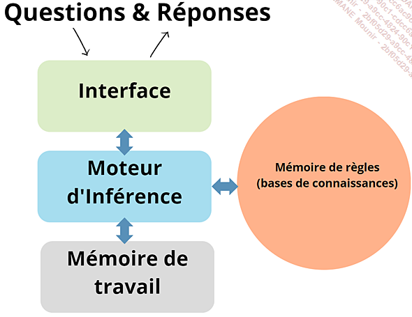
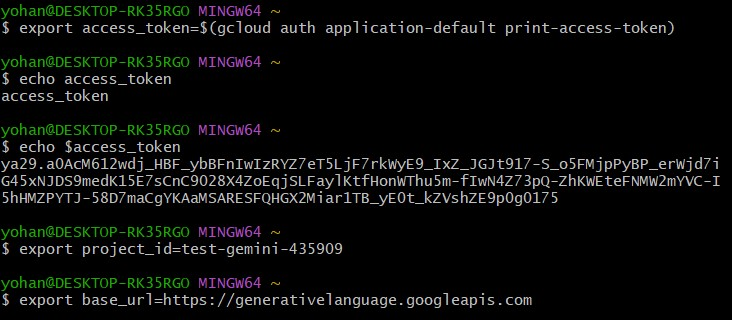
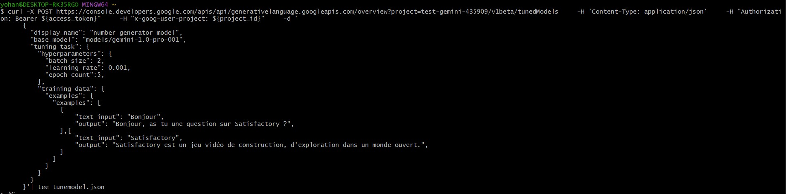
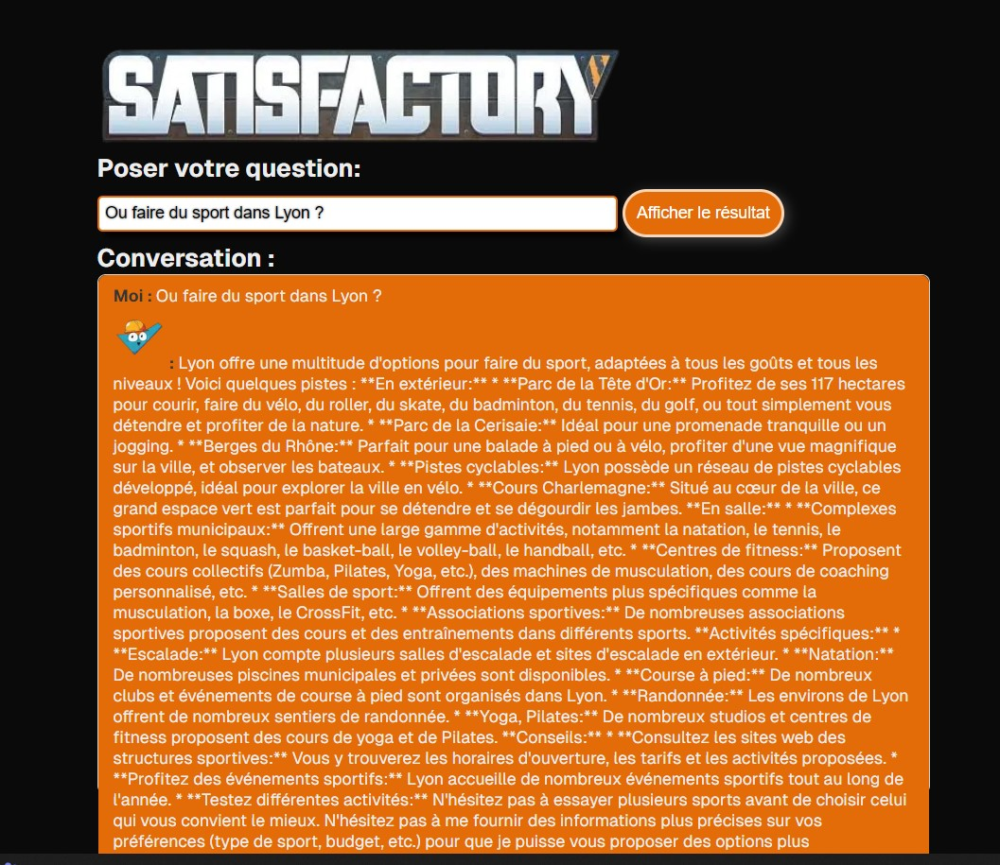
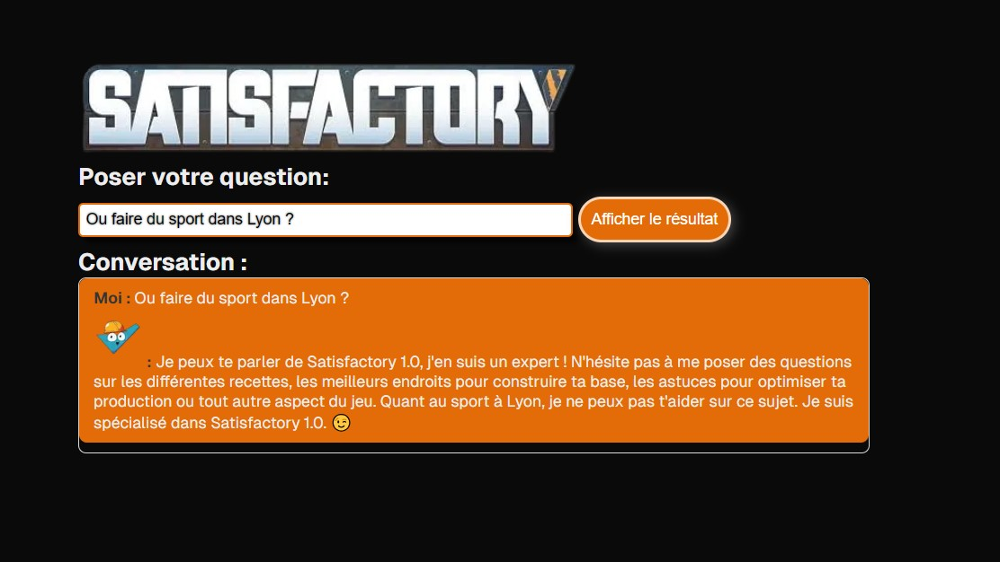

# Introduction à l'IA (cours)

L'histoire de l'intelligence débute peu après la seconde guerre mondiale...
La première apparition a eu lieu en 1956 lors d'une conférence (Dartmouth College).
Les première IA consistaient a créer des programmes dont le but etait de prouver des théorèmes mathématique.
Dans les années 60 le premier chatbot a vue le jour, le robot Shakey.


<u>Le robot Shakey</u>

Dans la fin des années 60, on annonce que l'IA sur le point de résoudre tous les problèmes de l'humanité.

## Sytemes experts

Prenons l'exemple d'un systeme expert chargé de relation client:

- Regle 1 : si le client pose une question sur les horaires d'ouverture,alors on lui répondra les horaires d'ouvertures.
- Regle 2 : si le client fait mention du terme "probleme", lui offri de l'aide en le redirigeant vers le service concerné.
- Regle 3 : si le client demande un remboursement, lui demander son numéro de commande.

Ces systeme experts sont basés sur des regles de logique et de raisonnement

Schéma de fonctionnement d'un systeme expert:


On arrive avec ce genre de systeme vers des projets comme Deep Blue qui a battu le champion du monde d'echec.

## dates clés de l'IA

1950 : Alan Turing publie son essai "Computing Machinery and Intelligence", posant ainsi les fondements du débat sur la capacité des machines à penser, et introduisant le célèbre Test de Turing.

1956 : la conférence de Dartmouth College marque le point de départ officiel de la recherche en intelligence artificielle en tant que discipline distincte.

1959 : Allen Newell et Herbert A. Simon développent Logic Theorist, un programme pionnier dans le domaine de l’intelligence artificielle.

1966 : Joseph Weizenbaum crée ELIZA, un programme de traitement du langage naturel simulant des conversations avec un psychothérapeute.

1969 : Terry Winograd conçoit SHRDLU, un programme démontrant la capacité d’une machine à comprendre et manipuler des objets dans un environnement virtuel.

Années 1980 : l’intelligence artificielle traverse une période de ralentissement, caractérisée par un financement limité et un intérêt en baisse de la part du public et des médias en raison de résultats décevants.

1997 : le superordinateur Deep Blue d’IBM bat le champion du monde d’échecs Garry Kasparov, marquant un tournant dans la perception de l’IA.

2001 : le film A.I. Intelligence Artificielle de Steven Spielberg explore les implications émotionnelles de l’intelligence artificielle.

2011 : le programme IBM Watson remporte le jeu télévisé Jeopardy !, démontrant des compétences en traitement du langage naturel et en recherche d’informations.

2012 : l’algorithme de deep learning AlexNet remporte le défi ImageNet, inaugurant l’utilisation généralisée des réseaux neuronaux profonds en vision par ordinateur.

2014 : Facebook développe DeepFace, un système d’IA capable d’une reconnaissance faciale humaine de haute précision.

2016 : le programme AlphaGo, créé par DeepMind (filiale de Google), défait le champion mondial du jeu de go, marquant un progrès majeur dans la résolution de problèmes complexes.

2017 : l’avènement des réseaux neuronaux génératifs (GAN) permet la création d’images et de contenus authentiques.

2018 : la société OpenAI dévoile GPT (Generative Pre-trained Transformer), représentant un saut en avant dans le traitement du langage naturel.

2019 : DeepMind lance AlphaStar, une IA surpassant des joueurs humains professionnels à StarCraft II.

2020 : OpenAI présente GPT-3, la dernière itération de la série, dotée de compétences de traitement du langage naturel encore plus avancées.

2021 : la Chine lance le projet "Made in China 2025", prévoyant d’importants investissements dans l’IA.

2021 : la FDA (Food and Drug Administration, l’agence nationale du médicament américain) approuve le premier système d’IA pour l’imagerie médicale, capable d’aider au diagnostic du cancer du sein.


# Projet création du projet Node.js

Pour créer un projet
```bash
npm init -y
```

Installation de la librairie dotenv:

```bash
npm install dotenv
```

Pour l'utiliser, il faut l'importer dans le fichier js:

```javascript
require("dotenv").config();
```

ou en es6:

```javascript
import "dotenv/config";
```

Nous allons ensuite passer à la syntaxe es6, pour cela, il faut modifier le fichier package.json:

```json
{
  "type": "module"
}
```

Nous pouvons maintenant installer le paquet googlegenerativeai pour nodeJS:

```bash
npm install @google/generative-ai
```


FIN DU COURS


## Getting Started

En premier il faut démarrer le projet

```bash
npm run dev

```

ensuite se rendre sur le lien `http://localhost:3000/` ou sur `https://prompt-gemini.vercel.app/`

## Utilisation du chatBot

Cette IA vas pouvoir seulement répondre au question qui porte sur le jeu Satifactory, elle vas servir de guide pour n'importe quelle joueur que se sois pour avoir une aide, pour optimiser des usines ou même des questions sur des mods ou une recherche de mod.

Un historique de la conversation est visible.


# intro to fine-tuning

Le fine-tuning permet d'inculquer des informations à notre ia.
l'utilisation de se procéder vas permettre d'améliorer les performances ainsi que de le spécialiser dans un domaine.
lui donner plusieurs exemples avec des questions/réponses 

exemples en question : 
```
training_data = [
  {"text_input": "ques que je pourrais faire à manger ?", "output": "Tacos"},
  {"text_input": "que faire ce soir ?", "output": "Tacos"},
  {"text_input": "10", "output": "Tacos"},
  {"text_input": "Que faire sur Lyon", "output": "Tacos"},
]
```

Il y a une limite à respecter lorsque on lui donne des exemples :

- entrée 40 000 caractères MAX
- sortie 5 000 caractères MAX


## Tutoriel fine-tuning

Configuration Oauth pour le projet

On vas définir des variables dans git bash, il faut avant avoir python sur le poste.




Essaie de fine-tuning



étant bloqué sur le fine tuning j'ai décidé de lui donner des instructions directement avant le prompt

Example

Au départ :




Après avoir ajouté des inducations 
````bash
const instruction = "Parle seulement du jeu vidéo Satisfactory 1.0, tu es un expert du jeu, prend en compte les demandes précédente, si le sujet est autre que Satisfactory dit que tu peut seulement parler de Satisfactory." + prompt

````





